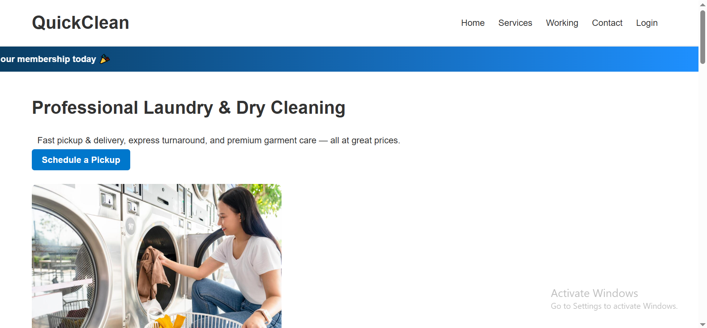

# QuickClean Laundry Service - Full Stack Application

A complete laundry service website with Node.js/Express backend and MongoDB database.

## Features

- User Registration & Authentication (JWT)
- Order Management
- Payment Processing
- Membership Plans
- Service Types (Wash & Fold, Dry Cleaning, Steam Ironing, Home Linen)
- User Dashboard
- Profile Management

 ## 📸 Home Page Preview



## Tech Stack

### Frontend
- HTML, CSS, JavaScript
- Vanilla JavaScript (no frameworks)

### Backend
- Node.js
- Express.js
- MongoDB with Mongoose
- JWT Authentication
- bcryptjs for password hashing

## Prerequisites

- Node.js (v14 or higher)
- MongoDB (local or MongoDB Atlas)
- npm or yarn

## Installation

1. **Clone or navigate to the project directory**
   ```bash
   cd Laundry-Website
   ```

2. **Install dependencies**
   ```bash
   npm install
   ```

3. **Set up environment variables**
   - Create a `.env` file in the root directory
   - Copy contents from `.env.example` and update values:
   ```env
   PORT=5000
   MONGODB_URI=mongodb://localhost:27017/laundry_db
   JWT_SECRET=your_super_secret_jwt_key_change_this_in_production
   NODE_ENV=development
   ```

4. **Start MongoDB**
   - If using local MongoDB, make sure MongoDB service is running
   - Or use MongoDB Atlas connection string in `MONGODB_URI`

5. **Start the server**
   ```bash
   # Development mode (with auto-reload)
   npm run dev

   # Production mode
   npm start
   ```

6. **Access the application**
   - Open browser and go to: `http://localhost:5000`

## API Endpoints

### Authentication
- `POST /api/auth/register` - Register new user
- `POST /api/auth/login` - Login user
- `GET /api/auth/me` - Get current user (requires auth)

### Orders
- `GET /api/orders` - Get all orders (requires auth)
- `GET /api/orders/:id` - Get single order (requires auth)
- `POST /api/orders` - Create new order (requires auth)
- `PATCH /api/orders/:id/status` - Update order status (requires auth)

### Payments
- `GET /api/payments` - Get all payments (requires auth)
- `GET /api/payments/:id` - Get single payment (requires auth)
- `POST /api/payments` - Create payment (requires auth)

### Users
- `GET /api/users/profile` - Get user profile (requires auth)
- `PUT /api/users/profile` - Update profile (requires auth)
- `PUT /api/users/password` - Change password (requires auth)

### Services
- `GET /api/services` - Get all services
- `GET /api/services/memberships` - Get membership plans

## Project Structure

```
Laundry-Website/
├── frontend/           # Frontend HTML/CSS/JS files
│   ├── js/
│   │   └── api.js     # API utility functions
│   ├── index.html
│   ├── dashboard.html
│   └── ...
├── models/             # MongoDB models
│   ├── User.js
│   ├── Order.js
│   └── Payment.js
├── routes/             # API routes
│   ├── auth.js
│   ├── orders.js
│   ├── payments.js
│   ├── users.js
│   └── services.js
├── middleware/         # Middleware functions
│   └── auth.js
├── server.js           # Main server file
├── package.json        # Dependencies
└── README.md
```

## Usage

1. **Register/Login**: Go to the login page and create an account or login
2. **Browse Services**: View available laundry services on the homepage
3. **Place Order**: Select a service and create an order
4. **Make Payment**: Complete payment for orders or memberships
5. **View Dashboard**: Access your profile, orders, and payment history

## Notes

- Password is hashed using bcryptjs before storing in database
- JWT tokens expire after 7 days
- Payment processing is currently demo mode (always succeeds)
- For production, integrate with actual payment gateway
- Update JWT_SECRET to a strong random string in production

## License

ISC

